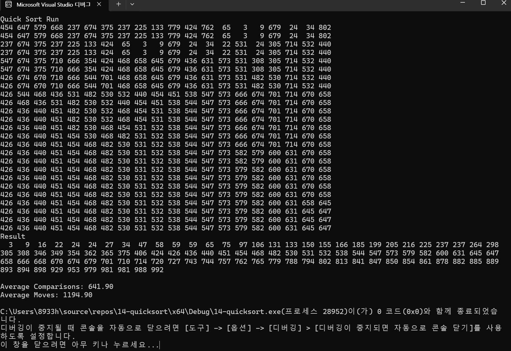

#이전 정렬방법(선택, 삽입, 버블, 쉘, 합병)과 성능 비교 설명
1.선택 정렬은 배열에서 가장 작은 값을 반복적으로 찾아서 앞으로 이동시키는 방식으로 작동합니다. 이 알고리즘은 시간 복잡도가 항상 O(n^2)로 일정하며,
데이터의 크기가 커질수록 매우 비효율적입니다. 하지만 퀵정렬은 데이터의 이동이 많지만 평균 시간 복잡도가 O(nlogn)로 훨씬 빠릅니다.

2.삽입 정렬은 정렬된 부분에 새로운 값을 삽입하는 방식으로 작동합니다. 정렬이 거의 완료된 배열에서는 O(n)의 좋은 성능이 나오지만, 무작위로 된 배열에서는
O(n^2)의 시간 복잡도를 가집니다. 대규모의 데이터에서는 퀵정렬이 O(nlogn)의 성능을 가지고 있기 때문에 더 적합합니다.

3.버블 정렬은 이웃한 두 값을 비교하여 정렬하는 방식인데, 모든 정렬 알고리즘에서 가장 느리고, 시간복잡도는 O(n^2)입니다.
단순하긴 하지만 매우 비효율적입니다.

4.쉘 정렬은 위에 삽입 정렬의 더 개선된 버전입니다. 데이터의 Gap을 줄여가면서 정렬합니다. 평균 시간 복잡도는 약 O(n^1.5)이므로 퀵정렬의 시간복잡도의
근접한 성능을 발휘합니다. 쉘 정렬은 데이터 패턴에 따라서 성능이 달라집니다. 작은 데이터에서는 퀵정렬과 비슷한 성능을 보입니다.

5.합병 정렬은 데이터를 반으로 나눠 가면서 정렬 하고 그 뒤에 다시 합치는 방식으로 작동합니다. 시간 복잡도는 O(nlogn)로 일정하며, 안정 정렬입니다.
합병 정렬은 최악의 경우에서도 동일한 시간 복잡도를 가지며, 퀵정렬은 최악의 경우에서는 O(n^2)로 느려질 수 있습니다.
퀵 정렬은 메모리를 적게 사용하지만, 합병 정렬은 추가적인 메모리 공간이 필요로 합니다. 합병 정렬은 데이터 크기가 크고 안정성이 있는 경우에 적합합니다.

